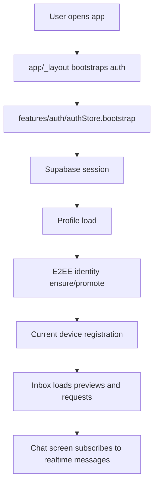

# KripChat Developer Guide

This guide is the first stop for new developers joining KripChat. It explains how the app is organized, where the important flows live, and what rules to follow when changing auth, chat, encryption, Supabase, or UI code.

## Product In One Paragraph

KripChat is a private realtime chat built with Expo, React Native, TypeScript, Expo Router, Zustand, and Supabase. Users identify publicly with a `hacker_handle` and password. Supabase Auth still uses an internal generated email because the Supabase password provider is email/password under the hood, but the user never sees or enters email in the app. Chat content is encrypted on the client before it is stored.

## Local Setup

Install dependencies:

```bash
npm install
```

Create local environment variables:

```bash
cp .env.example .env
```

Required public Expo variables:

```text
EXPO_PUBLIC_SUPABASE_URL=
EXPO_PUBLIC_SUPABASE_PUBLISHABLE_KEY=
EXPO_PUBLIC_ENCRYPTED_MEDIA_BUCKET=encrypted-media
EXPO_PUBLIC_SITE_URL=
```

Optional server-side variable for remote migrations:

```text
SUPABASE_DB_URL=
```

Never put service-role keys, database passwords, or private tokens in `EXPO_PUBLIC_` variables. Anything prefixed with `EXPO_PUBLIC_` can be bundled into the client.

Run the app:

```bash
npm run web
```

Run the normal checks before opening a PR:

```bash
npm run typecheck
npm run test:unit
```

Run web smoke QA when UI routes or navigation changed:

```bash
npm run test:qa
```

Run BDD QA when user-facing acceptance criteria changed:

```bash
npm run test:bdd
```

GitHub Actions runs this BDD suite in `.github/workflows/test.yml` for pull requests and pushes to `main`. The Pages deployment workflow also runs the same quality gates before publishing.

## Branch And PR Flow

`main` is protected. Do not push directly to `main`.

Use this flow:

```bash
git switch main
git pull --ff-only origin main
git switch -c codex/short-description
# make changes
npm run typecheck
npm run test:unit
git add <files>
git commit -m "Short description"
git push -u origin codex/short-description
gh pr create --draft --base main --head codex/short-description
```

Keep each PR focused. Auth changes, chat encryption changes, UI pricing changes, and Supabase migrations should usually be separate PRs.

## Directory Map

```text
app/                  Expo Router routes and screens
app/(auth)/           Login/register routes
app/(tabs)/           Authenticated tabs: inbox, profile, help
app/chat/[threadId]   Open chat screen
components/           Reusable UI primitives and message rendering
features/auth/        Auth service and auth Zustand store
features/chat/        Chat service, chat Zustand store, chat types
hooks/                Realtime typing and presence helpers
lib/                  Shared helpers: E2EE, validation, UX errors, theme
services/             Notifications and side-effect services
src/lib/crypto/       Device crypto provider abstraction
src/lib/storage/      Secure local storage wrappers
src/lib/supabase/     Supabase data helpers by domain
supabase/migrations/  Database schema, RLS, RPC, storage policies
__tests__/            Jest unit tests
tests/qa/             Playwright web smoke tests
tests/bdd/            Cucumber feature files, support world, and reusable steps
docs/                 Developer, API, and security documentation
```

The `src/screens/*` files are compatibility re-exports into the Expo Router app routes. Prefer editing the real route files in `app/`.

## Main Runtime Flow



## Authentication Flow

Important files:

- `app/(auth)/login.tsx`
- `app/(auth)/register.tsx`
- `features/auth/authService.ts`
- `features/auth/authStore.ts`
- `lib/validation.ts`
- `lib/userFeedback.ts`

Registration:

1. The user enters `hacker_handle` and password.
2. `normalizeUsername` sanitizes the handle.
3. `getAuthEmailForUsername` derives an internal email: `handle@kripchat.invalid`.
4. `signUpWithHandle` calls Supabase Auth with that internal email and password.
5. The public `username` and initial E2EE public key are sent in auth metadata.
6. The profile trigger creates the public profile row.
7. The auth store prepares E2EE identity, profile, device registration, and push token.

Login:

1. The user enters `hacker_handle` and password.
2. The app derives the same internal email.
3. Supabase Auth validates credentials.
4. The auth store loads the profile and registers the current device.

Do not reintroduce visible email fields in login/register unless the product direction changes.

## Chat Flow

Important files:

- `app/(tabs)/index.tsx`
- `app/chat/[threadId].tsx`
- `features/chat/chatStore.ts`
- `features/chat/chatService.ts`
- `components/MessageBubble.tsx`

Inbox:

1. `ChatListScreen` calls `loadPreviews` and `loadRequests`.
2. Realtime events on messages, encrypted messages, participants, requests, and conversations trigger refresh.
3. Opening a chat routes to `/chat/[threadId]`.

Open chat:

1. `ChatScreen` loads messages for the current conversation.
2. It subscribes to encrypted message inserts/updates for the current device.
3. It also listens for conversation deletion. If the conversation is destroyed, the screen removes local state and navigates back to the inbox.
4. Sending text or payloads goes through `chatStore.send`.

Delete for all:

1. `ChatScreen.confirmDestroyConversation` asks for explicit confirmation.
2. `destroyCurrentConversation` calls `chatStore.destroy`.
3. `chatService.destroyConversation` calls the Supabase RPC `destroy_conversation_for_everyone`.
4. Local store removes the conversation and the screen routes to the inbox.

## Message Encryption Flow

Important files:

- `features/chat/chatService.ts`
- `features/chat/chatStore.ts`
- `lib/e2ee.ts`
- `lib/cryptoPayload.ts`
- `src/lib/crypto/localCryptoProvider.ts`
- `src/lib/supabase/devices.ts`
- `src/lib/supabase/messages.ts`

Current primary message path:

1. Sender device is registered in `devices`.
2. The app reads active devices for every conversation member.
3. For each recipient device, `localCryptoProvider.encryptMessage` encrypts one message copy.
4. The app inserts those copies into `encrypted_messages`.
5. A recipient device fetches only rows where `recipient_device_id` matches its device id.
6. The client decrypts locally with the device private key.

Legacy compatibility path:

- `messages` still exists for fallback compatibility.
- `lib/cryptoPayload.ts` can decrypt legacy `krypchat:v1` envelopes and current `krypchat:v2` shared-key envelopes.
- New work should prefer the per-device `encrypted_messages` flow.

## Attachments Flow

Important files:

- `features/chat/chatService.ts`
- `lib/cryptoPayload.ts`
- `supabase/migrations/202604230001_chat_attachments.sql`

Attachment upload:

1. The app reads the local file as a Blob.
2. It derives the conversation shared key.
3. It encrypts the Blob into an `application/octet-stream` payload.
4. It uploads to the private encrypted media bucket (`EXPO_PUBLIC_ENCRYPTED_MEDIA_BUCKET`, `encrypted-media` in the new Supabase project).
5. Storage policies only allow conversation members to read/write paths under that conversation id.

Attachment open:

1. The app creates a signed URL with a short TTL.
2. It downloads the encrypted blob.
3. It decrypts locally.
4. It creates a local object URL or data URI for display.

Push notification bodies must stay generic. Never include plaintext message content in push notifications.

## Supabase And RLS

Important files:

- `lib/supabase.ts`
- `src/lib/supabase/client.ts`
- `supabase/migrations/*.sql`

Core concepts:

- `profiles` stores public handle/profile data and E2EE public key.
- `conversations` stores conversation metadata.
- `conversation_participants` and `conversation_members` store membership.
- `chat_requests` gates direct conversation creation.
- `devices` stores public device bundles.
- `encrypted_messages` stores ciphertext per recipient device.
- `blocked_users` stores user blocks.
- `security_audit_events` stores non-sensitive audit events.

RLS rules are part of the security model. When adding a table exposed through Supabase Data API:

1. Enable RLS.
2. Add explicit policies for select/insert/update/delete.
3. Grant access only to required roles.
4. Add tests or a manual SQL verification plan.

Do not use `raw_user_meta_data` or JWT user metadata for authorization decisions. Use database rows and RLS policies instead.

## State Management

Auth state lives in `features/auth/authStore.ts`.

Chat state lives in `features/chat/chatStore.ts`:

- previews
- chat requests
- messages by conversation
- realtime channels
- send/destroy/update actions

The store should own shared state transitions. Screens should handle route, modal, and input state.

## Membership Limits

Product pricing and plan copy live in `lib/membershipPlans.ts`.

The Free plan is intentionally generous enough to prove the product, but small enough to create a clear upgrade moment:

- Price: `$0`
- Purpose: para probar
- Positioning: La puerta de entrada para sentir KripChat sin compromiso.
- Chats: 1:1 cifrados
- Active conversations: 3
- History: basic
- Secure devices: 1

Use `FREE_PLAN_LIMITS` as the frontend contract when adding enforcement. The backend/RLS enforcement still needs a dedicated schema before this becomes a security boundary. Do not rely only on UI hiding for paid limits.

## UI Guidelines

Use existing UI primitives first:

- `ScreenShell`
- `GlassCard`
- `GlassButton`
- `MessageBubble`
- `ChatListItem`
- `Avatar`

Use `lib/theme.ts` for colors, spacing, radii, and fonts. Keep the app dark, operational, and compact. Avoid adding one-off color systems.

For auth/product copy:

- Say `hacker_handle`, `username`, or `cuenta`.
- Do not say users must enter email.
- Do not expose internal Supabase email derivation in product UI.

## Error Handling

Use `getUserFacingErrorMessage` from `lib/userFeedback.ts` for Supabase and business errors. It maps technical errors to product-safe messages.

When adding new user-facing flows:

1. Catch service errors in the screen.
2. Send the error through `getUserFacingErrorMessage`.
3. Keep raw technical details out of normal alerts unless they are necessary for debugging.

## Testing Strategy

Use focused tests for the changed layer:

- `__tests__/features/auth/authService.test.ts` for auth service behavior.
- `__tests__/features/chat/*` for chat service behavior.
- `__tests__/src/lib/crypto/*` for crypto provider behavior.
- `__tests__/lib/*` for shared helpers.
- `tests/qa/public-smoke.spec.ts` for public web route smoke coverage.
- `tests/bdd/features/*.feature` for business-readable BDD acceptance coverage.

Minimum before PR:

```bash
npm run typecheck
npm run test:unit
```

For UI route changes:

```bash
npm run test:qa
```

## Common Change Recipes

### Add A New Auth Message

1. Update the relevant screen in `app/(auth)/`.
2. Add or update mappings in `lib/userFeedback.ts`.
3. Update tests in `__tests__/lib/userFeedback.test.ts` if the mapping changes.
4. Run auth and feedback tests.

### Add A New Message Kind

1. Update `MessageKind` in `features/chat/types.ts`.
2. Update database enum/check constraints in a migration if needed.
3. Update `fallbackBodyForKind` in `features/chat/chatService.ts`.
4. Update message rendering in `components/MessageBubble.tsx`.
5. Add send-flow tests.

### Add A New Chat Security Control

1. Decide whether it is client-only, database-backed, or both.
2. Add schema/RLS/RPC migrations first if persistence is required.
3. Add service functions in `features/chat/chatService.ts`.
4. Add store actions in `features/chat/chatStore.ts`.
5. Wire UI in `app/chat/[threadId].tsx`.
6. Add tests around guardrails and failure cases.

### Add A Supabase Migration

Use Supabase CLI to create the migration:

```bash
npx supabase migration new descriptive_name
```

Then edit the generated SQL file. Do not invent migration timestamps manually.

## Production Security Notes

The current crypto provider is not an audited Signal Protocol implementation. It provides client-side encrypted device envelopes, but it should not be marketed as audited Signal-grade E2EE. See `docs/security-model.md` and `SECURITY.md` before making security claims.
