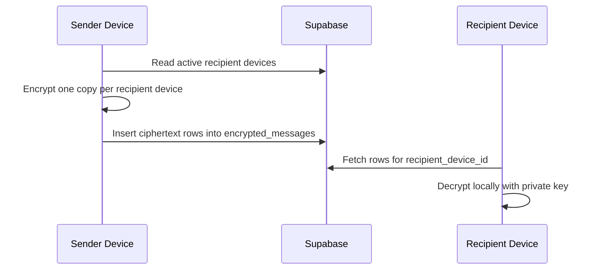

# KripChat Security Model

This document explains what currently makes KripChat secure, how chat content is protected, what Supabase can still see, and which claims are safe to make today.

## Security Goals

KripChat is designed around these goals:

1. Users do not need to expose email or phone numbers in the product UI.
2. Chat plaintext should not be stored in Supabase.
3. A device should only receive ciphertext intended for that device.
4. Database access should be constrained by RLS, even if someone calls the API directly.
5. Push notifications should not leak message content.
6. Sensitive destructive actions should clean server state and local UI state.

## Identity And Login

Users sign in with:

- `hacker_handle`
- password

Supabase Auth still receives an internal generated email because its password provider is email/password. The app derives it in `features/auth/authService.ts`:

```text
hacker_handle@kripchat.invalid
```

The internal email is implementation detail. Product UI should continue to show `hacker_handle`, `username`, or `cuenta`, not email.

## Client Key Material

The app creates local keypairs using TweetNaCl.

Important files:

- `lib/e2ee.ts`
- `src/lib/crypto/localCryptoProvider.ts`
- `src/lib/storage/secureStorage.ts`

Storage:

- Native mobile uses `expo-secure-store`.
- Web uses AsyncStorage, which is weaker and should not be treated like hardware-backed storage.

Public keys can be stored in Supabase. Private keys must remain local.

## Device Registration

Each logged-in device is registered in `devices`.

Important files:

- `src/lib/supabase/devices.ts`
- `features/auth/authStore.ts`
- `supabase/migrations/20260429073031_device_encrypted_messages_architecture.sql`

The device record includes:

- device id
- user id
- public identity key
- public signed prekey
- timestamps
- `revoked_at`

RLS policies only allow a user to insert/update their own devices. Other authenticated users can read active public device bundles because they need public keys to encrypt messages to that device.

## Current Message Encryption Path

Primary path:



Important files:

- `features/chat/chatService.ts`
- `features/chat/chatStore.ts`
- `src/lib/crypto/localCryptoProvider.ts`
- `src/lib/supabase/messages.ts`

For each message:

1. The sender device is registered.
2. Active conversation member devices are loaded.
3. One encrypted row is created per recipient device.
4. The row is inserted into `encrypted_messages`.
5. The open chat subscribes to realtime inserts and updates.
6. The recipient device decrypts locally.

The server stores ciphertext and metadata, not message plaintext.

## Legacy Message Compatibility

The app still contains compatibility support for legacy messages:

- table: `messages`
- helpers: `lib/cryptoPayload.ts`
- envelope prefixes: `krypchat:v1:` and `krypchat:v2:`

New chat work should prefer `encrypted_messages`. Keep legacy compatibility until old data can be migrated or intentionally retired.

## Attachments

Attachments are stored in the private encrypted media bucket configured by `EXPO_PUBLIC_ENCRYPTED_MEDIA_BUCKET` (`encrypted-media` in the new Supabase project).

Important files:

- `features/chat/chatService.ts`
- `lib/cryptoPayload.ts`
- `supabase/migrations/202604230001_chat_attachments.sql`

Upload flow:

1. Read local file as Blob.
2. Encrypt Blob client-side.
3. Upload encrypted payload as `application/octet-stream`.
4. Store path and metadata in the message row.

Open flow:

1. Create a short-lived signed URL.
2. Download encrypted payload.
3. Decrypt locally.
4. Render the decrypted local object URL or data URI.

Attachment metadata currently still reveals file type, size, and storage path. Do not claim metadata-hiding attachment security.

## Database Guardrails

RLS protects the database layer.

Important migration:

- `supabase/migrations/20260429073031_device_encrypted_messages_architecture.sql`

Examples:

- Only device owners can insert/update their device records.
- Only conversation members can insert encrypted messages into a conversation.
- Sender and recipient must both be members.
- Blocked users cannot send to each other.
- Sender device and recipient device must exist and not be revoked.
- Recipients can only read encrypted messages for their active devices.

RLS is not optional. Any new exposed table needs explicit RLS policies.

## Chat Requests And Blocking

Direct chats are gated by requests.

Important files:

- `features/chat/chatService.ts`
- `features/chat/chatStore.ts`
- `supabase/migrations/20260430081440_chat_request_inbox_flow.sql`

The app:

- normalizes peer usernames
- prevents chatting with yourself
- creates a pending request
- lets recipients accept/reject
- blocks conversation creation if either user blocked the other

Blocking is enforced in RPC and RLS-related checks, not only in UI.

## Delete For All

Important files:

- `app/chat/[threadId].tsx`
- `features/chat/chatStore.ts`
- `features/chat/chatService.ts`
- `supabase/migrations/20260430085851_make_destroy_conversation_global.sql`

The intended behavior:

1. User confirms "destroy for everyone".
2. Client calls `destroy_conversation_for_everyone`.
3. Server deletes encrypted messages, legacy messages, participants, requests, conversation rows, and attachments where allowed.
4. Local state removes the conversation.
5. The chat screen returns to the inbox.
6. If another client receives a realtime delete event, it also returns to the inbox.

This prevents a destroyed chat from leaving the UI mounted on a blank route.

## High Risk Mode

High risk mode is handled in `app/chat/[threadId].tsx`.

Current behavior:

- Blocks attachments in that chat.
- Blocks clipboard paste in that chat.
- On native platforms, asks Expo ScreenCapture to prevent screenshots/app switcher previews.
- Uses manual view-window controls for message reveal behavior.

Limitations:

- Web cannot reliably prevent screenshots.
- OS-level protections are best-effort.
- Compromised devices can still extract visible content.

## Push Notifications

Push bodies must stay generic.

Allowed examples:

- `Nuevo paquete seguro recibido.`
- `Nuevo adjunto seguro recibido.`

Disallowed:

- message text
- attachment names if sensitive
- location labels
- usernames in sensitive contexts

## What Supabase Can Still See

Even with encrypted content, Supabase can observe metadata:

- auth user ids
- `hacker_handle` / username
- public profile fields
- device ids and public key bundles
- conversation membership
- sender and recipient user ids
- sender and recipient device ids
- timestamps
- delivery/read timestamps when enabled
- attachment path, type, and size
- block relationships for the blocking user

This is not traffic-analysis resistant.

## Safe Security Claims Today

Safe:

- "Messages are encrypted on the client before storage."
- "Supabase stores ciphertext for chat payloads."
- "Messages are delivered as device-targeted encrypted rows."
- "Private keys stay on the client device."
- "RLS restricts who can read/write chat rows."
- "Push notifications do not include plaintext message content."

Not safe yet:

- "Audited Signal Protocol."
- "Military-grade encryption."
- "Metadata-private."
- "Anonymous."
- "Cannot be compromised."
- "Fully production-ready E2EE."

## Known Gaps Before Strong Production Claims

1. Replace `localCryptoProvider` with an audited Signal Protocol implementation.
2. Add device verification / safety number UX.
3. Add robust key rotation and recovery flows.
4. Add stale-device handling and user-visible device management.
5. Reduce attachment metadata leakage.
6. Review all RLS and storage policies independently.
7. Remove or migrate legacy `messages` storage.
8. Add threat-model tests for common bypass attempts.
